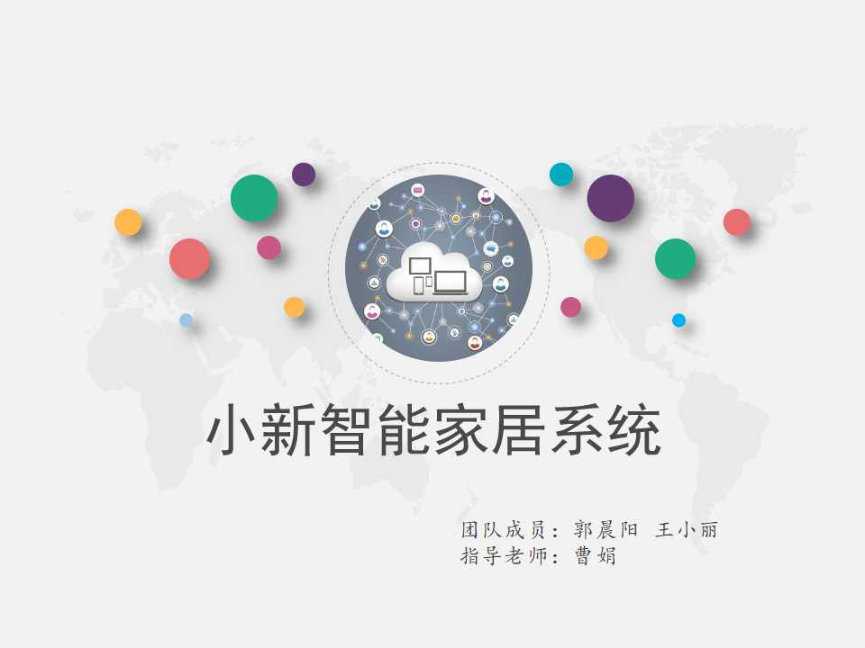
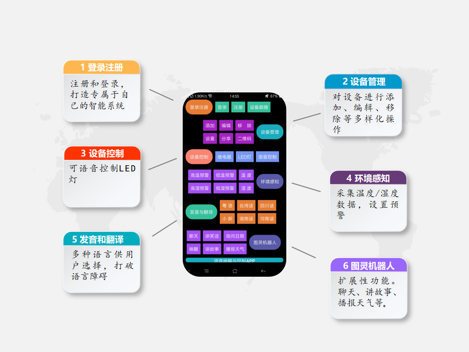
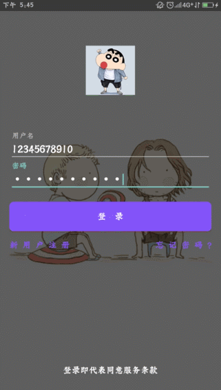
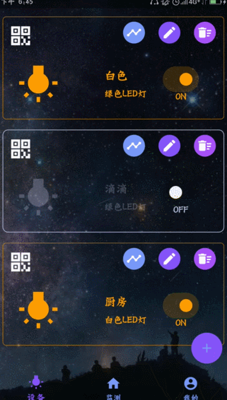
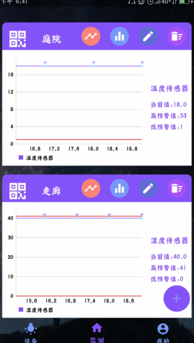
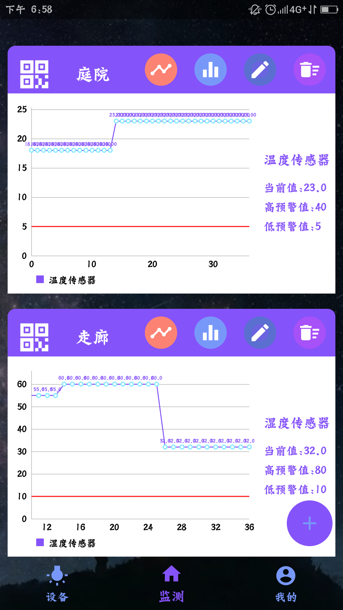
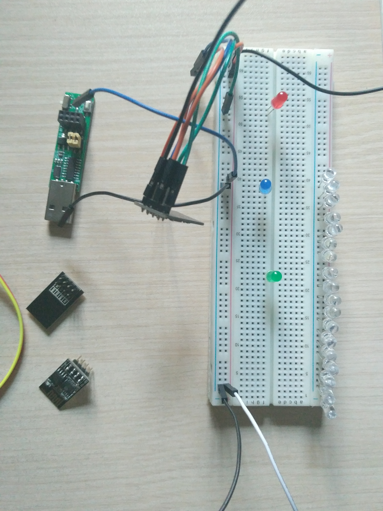
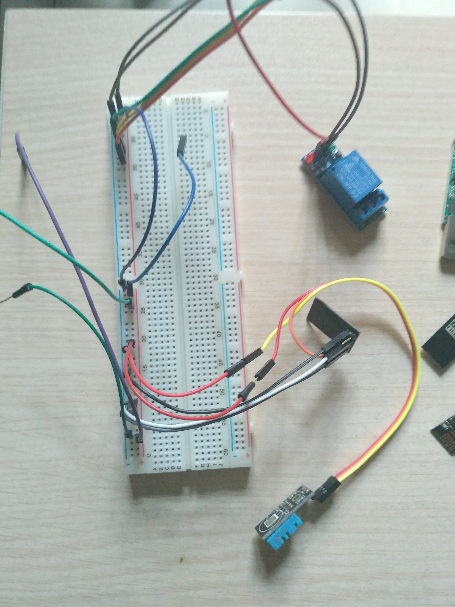

小新智能家居系统 
=========================

     
*****************
## 简介 :cyclone:
----------------------------------

#### 这是一款可以进行语言控制的智能家居系统，包括语音唤醒APP、语音开关灯、语音播报温度/湿度传感器值，此外语音交互后台接入了图灵机器人，除了特殊的控制指令识别外跟苹果的siri相似可以聊天、讲故事等。同时，该系统还可以远程控制，无论何时何地接入互联网手机便可以控制灯和采集温度/湿度，另外系统还包括了高低温、高低湿度预警功能。系统设计时面向硬件设备管理，具有丰富的可扩展性。

-----------------------------------------

## 功能简介 :cyclone:

### 登录与注册 :cyclone:

|||
|---|---|
|__登录__|__注册__|

### 设备控制与环境感知 :cyclone:

|||
|---|---|
|__登录__|__注册__|

### 其他 :cyclone:

||||
|---|---|---|
|__温湿度界面__|__二维码扫描界面__|__选择发音人__|

## 硬件实物图 :cyclone:

|||
|---|---|
|__LED灯控制__|__温湿度传感器__|

--------------------------------
